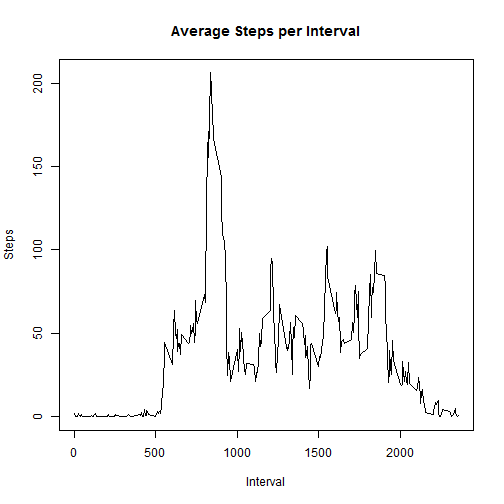

# Reproducible Research: Peer Assessment 1


## Loading and preprocessing the data

Unzip and read the data into R.

```r
unzip("activity.zip")
activity <- read.csv("activity.csv")
```


Create a datetime variable by combining date and interval.

```r
activity$interval <- sprintf("%04d", activity$interval)  # pad to 4 digits
activity$datetime <- paste(activity$date, activity$interval, sep = " ")
activity$datetime <- strptime(x = activity$datetime, format = "%F %H%M")
```


## What is mean total number of steps taken per day?

We want to calculate summary statistics and make a histogram of the total number of steps taken each day. First, we must calculate the total number of steps each day. Then, plot the histogram and calculate the summary statistics.


```r
totalSteps <- aggregate(activity$steps ~ activity$date, FUN = sum)
hist(totalSteps[, 2], main = "Histogram of Total Steps", xlab = "Total Steps in a Day")
```

 

```r
mean(totalSteps[, 2])
```

```
## [1] 10766
```

```r
median(totalSteps[, 2])
```

```
## [1] 10765
```


## What is the average daily activity pattern?

We need the number of steps taken at each time interval as averaged across all days.

```r
intervals <- aggregate(activity$steps ~ activity$interval, FUN = mean)
plot(intervals[, 1], intervals[, 2], type = "l", xlab = "Interval", ylab = "Steps", 
    main = "Average Steps per Interval")
```

 


Find the interval with the highest average number of steps.

```r
intervals[which.max(intervals[, 2]), 1]
```

```
## [1] "0835"
```


## Imputing missing values

The total number of records missing values can be found using is.na().

```r
sum(is.na(activity[, 1]))
```

```
## [1] 2304
```


Missing data values will be imputed by setting them equal to the mean for that interval across all days. These mean values were calculated earlier. A new data set including imputed values will be generated.

```r
stepsNew <- numeric(length = nrow(activity))
for (r in 1:nrow(activity)) {
    if (is.na(activity[r, 1])) {
        missingInterval <- activity[r, 3]
        stepsNew[r] <- intervals[which(intervals[, 1] == missingInterval), 2]
    } else {
        stepsNew[r] <- activity[r, 1]
    }
}
activityNew <- cbind(stepsNew, activity[, 2:4])
```


We'll make a histogram as before but using the new data set with imputed values.


```r
totalStepsNew <- aggregate(activityNew$stepsNew ~ activityNew$date, FUN = sum)
hist(totalStepsNew[, 2], main = "New Histogram of Total Steps", xlab = "Total Steps in a Day")
```

 

```r
mean(totalStepsNew[, 2])
```

```
## [1] 10766
```

```r
median(totalStepsNew[, 2])
```

```
## [1] 10766
```


There was a very small effect from imputing the missing values for this data set. The shape of the distribution is essentially the same. The mean value is the same as before, and the median is only slightly higher.

## Are there differences in activity patterns between weekdays and weekends?

Create a factor variable indicating if the observation was on a weekday or weekend.

```r
activityNew$day <- weekdays(x = activityNew$datetime)
for (i in seq_along(activityNew$day)) {
    if (activityNew$day[i] == "Saturday" | activityNew$day[i] == "Sunday") {
        activityNew$dayOrEnd[i] <- "weekend"
    } else {
        activityNew$dayOrEnd[i] <- "weekday"
    }
}
activityNew$dayOrEnd <- as.factor(activityNew$dayOrEnd)
```


Average over the intervals separately for weekends and weekdays.


```r
intervalsWeekday <- aggregate(activityNew$stepsNew[activityNew$dayOrEnd == "weekday"] ~ 
    activityNew$interval[activityNew$dayOrEnd == "weekday"], FUN = mean)
intervalsWeekend <- aggregate(activityNew$stepsNew[activityNew$dayOrEnd == "weekend"] ~ 
    activityNew$interval[activityNew$dayOrEnd == "weekend"], FUN = mean)
```


Plot the average steps per interval for weekdays and weekends.


```r
par(mfcol = c(2, 1))
plot(intervalsWeekend[, 1], intervalsWeekend[, 2], type = "l", xlab = "Interval", 
    ylab = "Number of Steps", main = "Weekend", ylim = c(0, 250))
plot(intervalsWeekday[, 1], intervalsWeekday[, 2], type = "l", xlab = "Interval", 
    ylab = "Number of Steps", main = "Weekday", ylim = c(0, 250))
```

 

